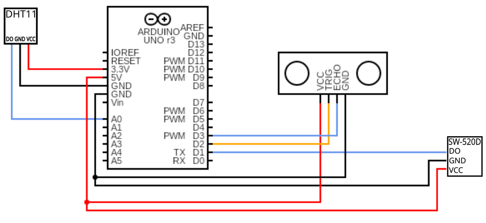

# PIPBOI Build Tutorial

**Note that there is no official case or any other mean of making the whole setup wearable.**

## Requirements:

(For PIPBOI MK1.x)

- RPi 3/4/5
- Waveshare 3.5" display
- Arduino UNO R4 WiFi
- Ultrasound sensor (HC-SRO4)
- Temperature/humidity sensor (DHT11)
- Optional tilt sensor (SW-520D)
- Any input device(Bluetooth mini keyboard recommended)

## Step 1:

**(Assuming you have installed OS on your RPi)**

Locate a tutorial on how to setup your Waveshare display. It usually consists of downloading and installing drivers, so Internet connection is needed.

## Step 2:

With your display now running, you might want to change the resolution, if you're using the Waveshare 3.5" display the recommended resolution is 640x480.

## Step 3:

**Sensors and Arduino**

With wires and a breadboard connect Arduino and the sensors accordingly:

> Note that different sensors can have different pin orientation.

## Step 4:

Install Arduino IDE v2. Locate and download library for your Arduino. Install Dependancy libraries `DHT` and `ArduinoGraphics`, connect the Arduino to your PC, copy `sensor_controller.ino` from `pipboi/src/sensors` into the IDE. Load the code into the Arduino.

Disconnect Arduino from your PC.

## Step 5:

Connect Arduino into your RPi, and in the config file `pipboi/conf/sens_conf.json` update the serial port your Arduino is connected on.

## Step 6:

On the PIPBOI startup, you should see unit test passed for serial connection. You can test out each sensor with commands (more in help command).
